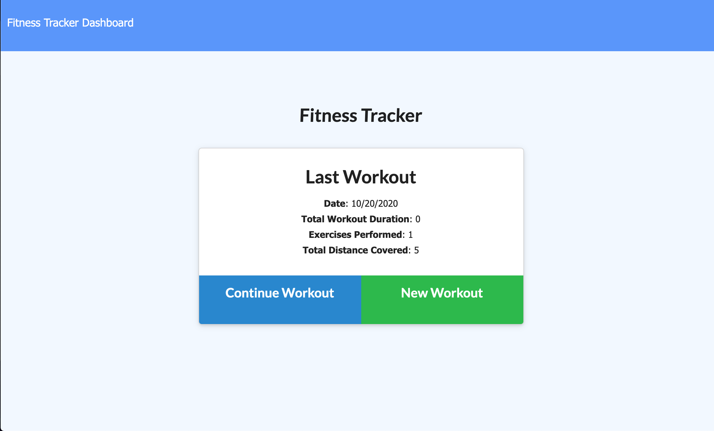
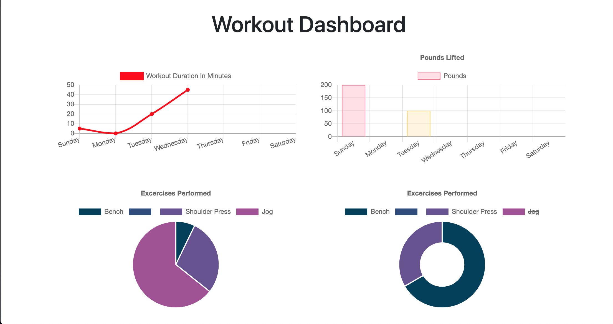

# Workout-Tracker

## Description

This is an application that provides the user the ability to view create and track daily workouts. The app allows the user to log multiple exercises in a workout on a given day. The user will also be able to track the name, type, weight, sets, reps, and duration of exercise.

**## Table of Contents**

1. [Installation Instructions](#installation-instructions)
2. [Usage Information](#usage-information)
3. [Test Instructions](#test-instructions)
4. [Questions](#questions)

## Installation Instructions

If SSH keys are installed, you can install the program by cloning it to your local machine by running git clone git@github.com:dolanpettit/Workout-Tracker.git. Once you have succesfully cloned to your local machine, be sure to install all required dependencies for application by running "npm i" in the command line.

## Usage Information

This application is deployed on Heroku and can be accessed by visiting this link: <a href="https://blooming-eyrie-07035.herokuapp.com/?id=5f8edf2ec6627400178cb17c">Deployed link</a>

## Test Instructions

There are currently no testing suites for this application.

# Questions

For any questions about this assignment, feel free to reach out to me on github or my email.

https://github.com/dolanpettit

dolanpettit@gmail.com
